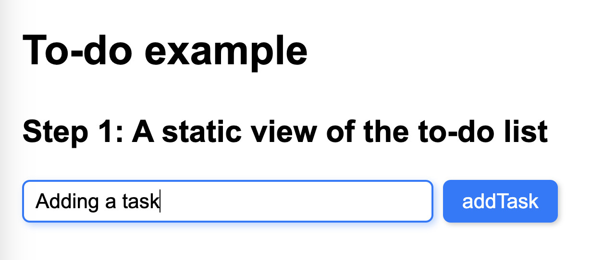
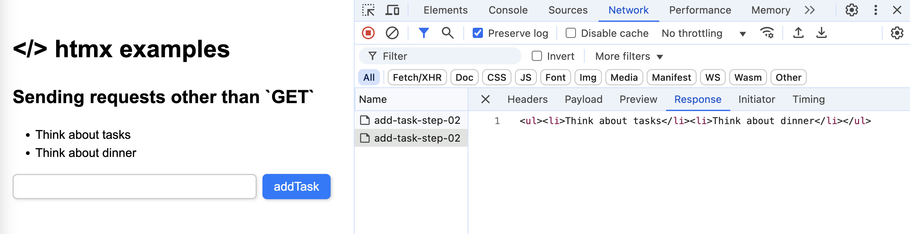
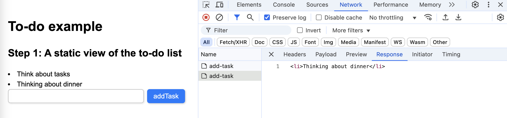
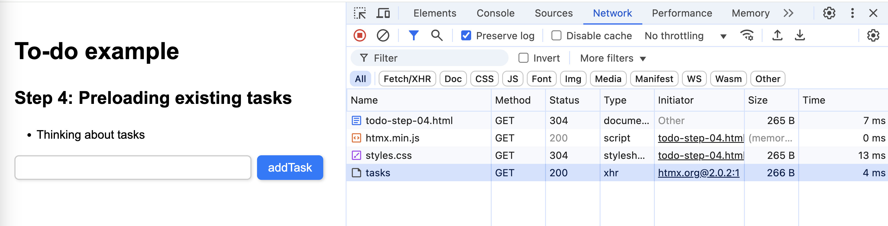

# ✅ To-do list example

This folder contains a **very simple yet functional to-do list application** built using **htmx**. It demonstrates how to dynamically add and remove tasks without reloading the page, and how to use **htmx** to send requests and update the DOM declaratively.

This example accompanies the talk: **_htmx 2.0 & Web Components: A Perfect Match for Frontend Development_**. For more details, visit the [main README](../README.md).

Here is the section for **Step 1: A static view of the to-do list**, following the same style as the previous examples:

---

## 📌 Step 1: A static view of the to-do list

We start with a **basic static structure** for the to-do list. This step sets up the **HTML layout** without any interactivity yet.

📁 **File:** `./todo-step-01.html`
```html
<div id="app" class="container">
  <div id="todo-list"></div>
  <form id="addTask">
    <input type="text" name="task" required />
    <input type="submit" value="addTask" />
  </form>
</div>
```


_Above: Step 1: A static view of the to-do list._

### 🔹 How it works

- The `#todo-list` `div` is an **empty placeholder** where tasks will be displayed.
- The form allows users to **input a task** and submit it.
- **At this stage, the form does nothing yet**, submitting the form will trigger a default page reload.

This is just a **static HTML structure**. In the next steps, we will enhance it with interactivity using **htmx**.

---

## 📌 Step 2: Adding the htmx library

Now that we have a **static structure**, we integrate **htmx** to make the form submit dynamically without reloading the page.

📁 **File:** `./todo-step-02.html`
```html
<script src="https://unpkg.com/htmx.org@2.0.2"></script>

<div id="app" class="container">
  <div id="todo-list"></div>
  <form
    id="addTask"
    hx-post="/add-task"
    hx-trigger="submit"
    hx-target="#todo-list"
  >
    <input type="text" name="task" required />
    <input type="submit" value="addTask" />
  </form>
</div>
```


_Above: Step 2: Adding the htmx library._


### 🔹 How it works

- We **include htmx** by adding the `<script>` tag:
  ```html
  <script src="https://unpkg.com/htmx.org@2.0.2"></script>
  ```
- The form is now **enhanced with htmx attributes**:
  - `hx-post="/task"`: **Sends a `POST` request** to `/add-task` when submitted.
  - `hx-trigger="submit"`: **Triggers the request when the form is submitted**.
  - `hx-target="#todo-list"`: **Replaces the content of `#todo-list`** with the server response.

With this setup, when a **user submits a new task**, the request will be sent via AJAX, and the to-do list will **update without a full page reload**.

### 🔧 Let's have a peek at the server-side:

📁 **File:** `./server/index.js`
```js
let taskList = [];

app.post('/add-task-step-02', (req, resp) => { 
  let task = req.body.task;
  taskList.push(`<li>${task}</li>`);  
  resp.send(`<ul>${taskList.join('')}</ul>`);
});
```

The server maintains **a simple `taskList` array** to store tasks. When the form **sends a `POST` request** to `/add-task-step-02`, the server:

  1. Extracts the **task text** from `req.body.task`.
  2. Adds it to the `taskList` array, wrapping it in `<li>...</li>`.
  3. Sends back an **updated `<ul>` list** containing all tasks.

Since the **htmx request targets `#todo-list`**, the updated list **replaces** its content in the frontend **without a full page reload**.

Now, when a user submits a new task, it appears instantly **without needing to write any JavaScript on the frontend**.

---

## 📌 Step 3: Appending tasks instead of replacing the list

In the previous step, submitting a task replaced the entire to-do list with the new server response. Now, we improve the behavior by **appending new tasks to the existing list** instead of replacing it.

📁 **File:** `./todo-step-03.html`
```html
<script src="https://unpkg.com/htmx.org@2.0.2"></script>

<div id="app" class="container">
  <div id="todo-list"></div>
  <form
    id="addTask"
    hx-post="/task"
    hx-trigger="submit"
    hx-target="#todo-list"
    hx-swap="beforeend"
  >
    <input type="text" name="task" required />
    <input type="submit" value="addTask" />
  </form>
</div>
```

  
_Above: Step 3: Appending tasks instead of replacing the list._

### 🔹 How it works

We add `hx-swap="beforeend"`, which **appends** new tasks **to the existing `#todo-list`** instead of replacing it. 

### 🔧 A peek at the updated server-side

To support this change, we slightly modify the server response to sent only the new element

📁 **File:** `./server/index.js`
```js
app.post('/task', (req, resp) => { 
  let task = req.body.task;
  taskList.push(`<li>${task}</li>`);  
  resp.send(`<li>${task}</li>`);s
});

```
Instead of returning the entire `<ul>` list, the server **now only sends the new `<li>` element**.  Since **`hx-swap="beforeend"`** is used, **htmx appends** the new `<li>` to `#todo-list`, keeping existing tasks.

---

## 📌 Step 4: Preloading existing tasks

So far, we’ve made it possible to add tasks dynamically, but what happens if the user **refreshes the page**? Right now, the list **starts empty** on every load. In this step, we **preload existing tasks** when the page loads.

📁 **File:** `./todo-step-04.html`
```html
<script src="https://unpkg.com/htmx.org@2.0.2"></script>

<div id="app" class="container">
  <div 
    id="todo-list"
    hx-get="/tasks"
    hx-trigger="load"
  ></div>
  <form
    id="addTask"
    hx-post="/task"
    hx-trigger="submit"
    hx-target="#todo-list"
    hx-swap="beforeend"
  >
    <input type="text" name="task" required />
    <input type="submit" value="addTask" />
  </form>
</div>
```

  
_Above: Step 4: Preloading existing tasks._

### 🔹 How it works

We **modify `#todo-list`** to **automatically load tasks** from the server. The `hx-trigger="load"` attribute **triggers a request when the page loads**, and `hx-get="/tasks"` sends it as a **`GET` request** to `/tasks` to retrieve the current task list. The server **returns the existing tasks**, which are **displayed inside `#todo-list`**.

### 🔧 A peek at the updated server-side

To support this change, we add a new route that **returns the existing tasks** when requested.

📁 **File:** `./server/index.js`
```js
let taskList = [];

app.get('/tasks', (req, resp) => {
  resp.send(`<ul>${taskList.join('')}</ul>`);
});

app.post('/task', (req, resp) => { 
  let task = req.body.task;
  taskList.push(`<li>${task}</li>`);  
  resp.send(`<li>${task}</li>`);
});
```
The new `GET /tasks` route **sends the current list of tasks** as an `<ul>` element. This allows **existing tasks to be displayed** when the page loads. The `/task` route remains unchanged.

---