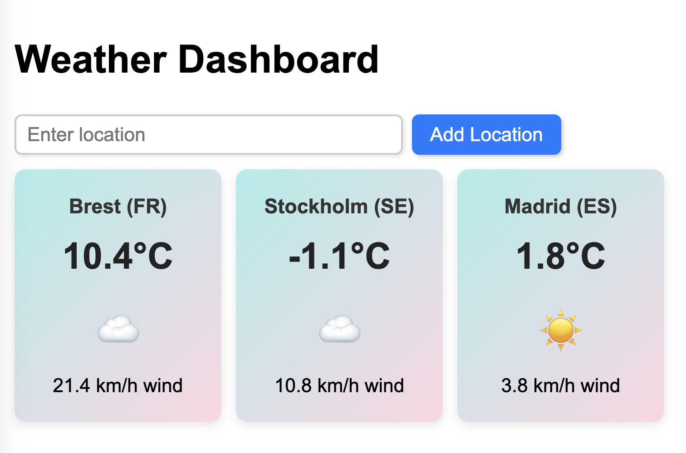

# 🌤️ Dynamic Weather Dashboard

This folder contains a **Weather Dashboard** that dynamically fetches and displays weather information using **htmx** and **Lit Web Components**.  

- **htmx** manages the global **UI and interactions**.
- **Lit Web Components** encapsulate **individual weather displays**.
- **Open-Meteo API** provides real-time weather data.

This example accompanies the talk: **_htmx 2.0 & Web Components: A Perfect Match for Frontend Development_**. For more details, visit the [main README](../README.md).

---

  
_Above: Weather Dashboard._


## 📌 Overview

The Weather Dashboard allows users to **add locations dynamically** and retrieve weather information without reloading the page.

## 📌 Weather Dashboard UI

📁 **File:** `./weather-dashboard.html`
```html
<!DOCTYPE html>
<html lang="en">
<head>
  <meta charset="UTF-8">
  <meta name="viewport" content="width=device-width, initial-scale=1.0">
  <title>Weather Dashboard</title>
  <link rel="stylesheet" href="../styles.css">
  <script type="module" src="./weather-widget.js"></script>
  <script src="https://unpkg.com/htmx.org@2.0.2"></script>
</head>
<body>

  <h1>Weather Dashboard</h1>

  <form id="location-form" 
      hx-post="/location" 
      hx-target="#weather-list" 
      hx-swap="beforeend">
    <input type="text" name="location" placeholder="Enter city, country (optional)" required>
    <button type="submit">Add Location</button>
  </form>

  <div 
      id="weather-list" 
      class="dashboard"
      hx-get="/locations"
      hx-trigger="load"></div>

</body>
</html>
```

---

## 📌 The `<weather-widget>` Web Component

📁 **File:** `./weather-widget.js`
```js
import { LitElement, html, css } from 'https://cdn.jsdelivr.net/gh/lit/dist@3/core/lit-core.min.js';

export class WeatherWidget extends LitElement {
  static get properties() {
    return {
      name: { type: String },
      latitude: { type: Number },
      longitude: { type: Number },
      weatherData: { type: Object }
    };
  }

  static get styles() {
    return css`
      :host {
        display: block;
        font-family: 'Arial', sans-serif;
      }
      .weather-container {
        display: flex;
        flex-direction: column;
        align-items: center;
        padding: 1.5rem;
        border-radius: 12px;
        background: linear-gradient(135deg, #a8edea 0%, #fed6e3 100%);
        box-shadow: 0 4px 10px rgba(0, 0, 0, 0.1);
        min-width: 180px;
        max-width: 260px;
        text-align: center;
      }
      .weather-emoji {
        font-size: 3rem;
        margin: 0.5rem 0;
        cursor: help;
      }
      .weather-emoji:hover::after {
        content: attr(data-tooltip);
        position: absolute;
        bottom: -30px;
        left: 50%;
        transform: translateX(-50%);
        background: rgba(0, 0, 0, 0.75);
        color: #fff;
        padding: 4px 8px;
        border-radius: 4px;
        font-size: 0.9rem;
        white-space: nowrap;
      }
    `;
  }

  constructor() {
    super();
    this.name = "";
    this.latitude = 0;
    this.longitude = 0;
    this.weatherData = null;
  }

  connectedCallback() {
    super.connectedCallback();
    this.fetchWeather();
  }

  async fetchWeather() {
    const url = `https://api.open-meteo.com/v1/forecast?latitude=${this.latitude}&longitude=${this.longitude}&current_weather=true`;
    try {
      const response = await fetch(url);
      const data = await response.json();
      this.weatherData = data.current_weather;
    } catch (error) {
      console.error('Failed to fetch weather data:', error);
    }
  }

  render() {
    return html`
      <div class="weather-container">
        <div class="weather-header">${this.name}</div>
        ${this.weatherData
          ? html`
              <div class="weather-temp">${this.weatherData.temperature}°C</div>
              <div class="weather-emoji" 
                  data-tooltip="Weather condition">
                🌤️
              </div>
              <div>${this.weatherData.windspeed} km/h wind</div>
            `
          : html`<p>Loading...</p>`}
      </div>
    `;
  }
}

customElements.define('weather-widget', WeatherWidget);
```

---

## 📌 Backend Routes

📁 **File:** `server.js`
```js
app.get('/locations', async (req, res) => {
  let locations = '';
  try {
    locations += await getWeather('Brest', 'FR') + '\n';
    locations += await getWeather('Stockholm', 'SE') + '\n';
    locations += await getWeather('Madrid', 'ES');
    res.send(locations);
  } catch (error) {
    console.error(error);
    res.send(`<p>${error.message}</p>`);
  }
});

app.post('/location', async (req, res) => {
  const input = req.body.location.trim();
  const parts = input.split(',').map(part => part.trim());
  const city = parts[0];
  const country = parts.length > 1 ? parts[1] : "";
  
  try {
    res.send(await getWeather(city, country));
  } catch (error) {
    console.error(error);
    res.send(`<p>${error.message}</p>`);
  }
});
```

---

## 📌 Summary

- **htmx manages the global UI** (adding/removing locations dynamically).
- **Lit encapsulates the weather display** (reusable and independent).
- **Zero JavaScript needed for interactions** (htmx does it declaratively).

---

[⬅ Back to main README](../README.md)